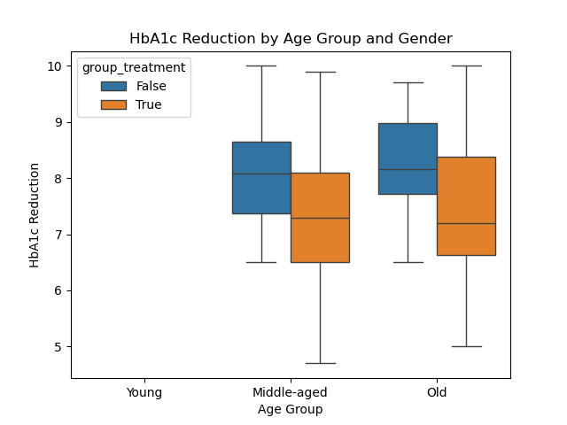
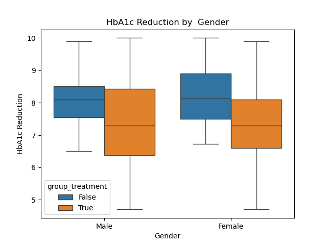
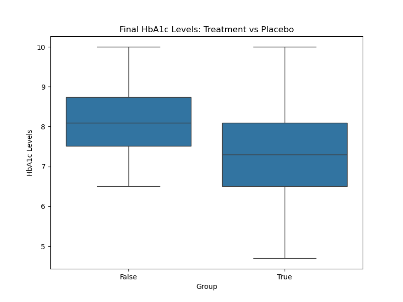
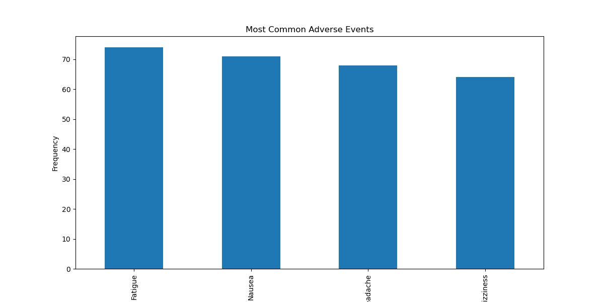
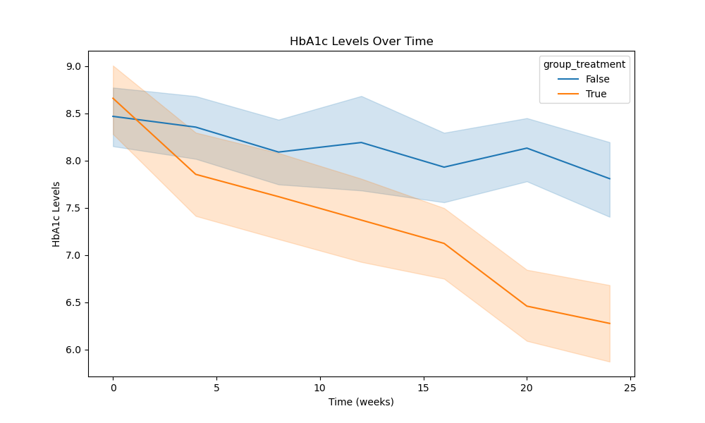

# Clinical Trial Data Analysis for a New Diabetes Medication

[Notebook Link](https://github.com/Kurodataio/diabetes-clinical-trial/blob/main/Clinical-Trial-Data-Analysis-New-Diabetes-Medication.ipynb)  

---

## Table of Contents

- [Overview](#overview)  
- [Dataset](#dataset)  
- [Technologies Used](#technologies-used)  
- [Installation](#installation)  
- [Usage](#usage)  
- [Analysis & Visualizations](#analysis--visualizations)  
- [Conclusion](#conclusion)  
- [Credits](#credits)  
- [License](#license)  

---

## Overview

PharmaTech, a leading pharmaceutical company. The company has recently completed a phase III clinical trial for a new type 2 diabetes medication

The request was to conduct a comprehensive analysis of PharmaTech's clinical trial data to evaluate the efficacy and safety profile of a new Type 2 diabetes medication.

---

## Dataset

- The dataset was provided by ITOnlinelearning.com 
- The dataset has 9 columns and 1400 rows
- The **hba1c** column (feature) is central to the analysis  
- The "adverse_event" feature had over 80% null values and was dropped.

---

<h2>Technologies Used</h2>

<ul>
  <li><strong>Languages & Libraries:</strong> Python, Pandas, NumPy, Matplotlib, Seaborn, Statsmodels, Scipy, Sklearn</li>
  <li><strong>Tools:</strong> Jupyter Notebook, VS Code, Git, GitHub</li>
</ul>

<p>
  
  
  
  
  
  
  
  
</p>
<P>
  
    
  
  
</p>
<p>
  
</p>

---

## Installation

Step-by-step instructions to set up the project locally:

```bash

# Clone the repository
git clone https://github.com/Kurodataio/diabetes-clinical-trial.git

# Navigate to the project folder
cd diabetes-clinical-trial

# Launch Jupyter Notebook
jupyter notebook

```

## Usage

Instructions for using the project:

1. Open the main notebook (`Clinical-Trial-Data-Analysis-New-Diabetes-Medication.ipynb`)  
2. Run each cell sequentially or run ALL cells to reproduce the analysis  
3. Visualizations and results will be generated automatically  

---

## Analysis & Visualizations 

- The trial cohort show reducions in both genders for middle-aged and old cohorts


- The medication appears to have more efficacy in males than females


- The treated cohort or group had lower HbA1c Levels than the placebo group at the end of the trial


- Hypothesis testing techniques (p < 0.01), confirm statistically significant reductions in HbA1c levels for the treatment group compared to placebo.

- Fatigue, Nausea, headaches and dizziness were the most common adverse events noted in the trial


- The HbA1c levels over time plot shows the downward trend of HbA1c for teh trial cohort


---

## Conclusion 

- The treatment is effective across demographic segments (age groups and gender).
- There is wider range of variability in HbA1c outcomes among older (60+) and male cohorts, with consistent treatment efficacy across most demographics.
- There is no significant relationship between duration of diabetes and treatment effectiveness.
- **The medication demonstrates statistically significant efficacy and a favourable safety profile, supporting recommendation for progression towards commercialisation (subject to regulatory approval).**

---

## Credits

- **Tutorials / References:** ITOnlinelearning.com 
- **Dataset Source:** ITOnlinelearning.com 
---

## License

This project is licensed under the [MIT License](https://choosealicense.com/licenses/mit/). PharmaTech is a fictional company.  

---

